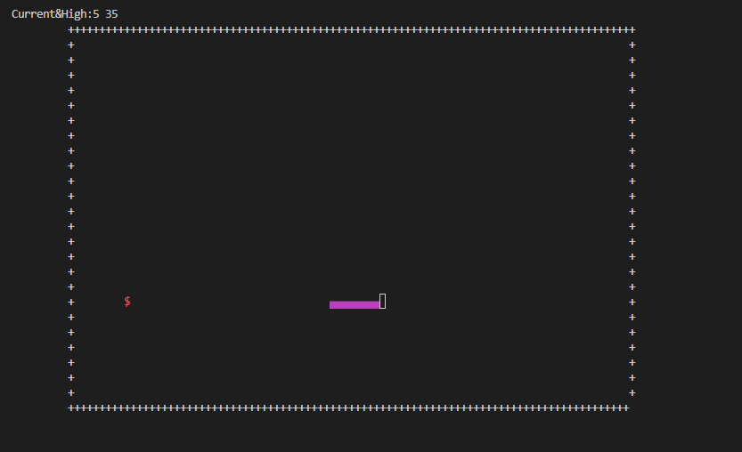
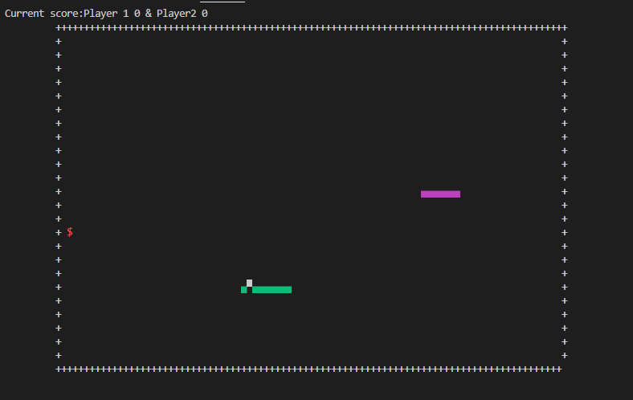
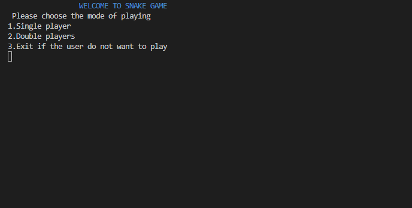

# DEVELOPMENT DOC OF SNAKE GAME

## Contents
- [Introduction](#introduction)
- [Explanation](#explanation)
- [List of function](#list-of-function)

## Introdution
> Snake is a video game that originated during the late 1970s in arcades becoming
something of a classic. The player controls long creature resembling snake a snake, picking up food. The users control the direction of the head(UP,LEFT,RIGHT,DOWN) and the snake's body flows.
>
Here is an overview of how the snake should be and how the game looks like:


## Explantion
### Movement control
The idea of designing the movement of snake: 
This is a 2D game so I need two arrays to store the coordinates(x,y) x[], y[] to display the position of the snake (In my project, I use structure to store these)
**Two array store the x,y coordinates of all joint dots of snake: int x[],int y[]**
*Note that, a standard screen 25x80 has 25 lines and 80 colums.*
If the snake eat the apple, it grows by one more section.
For example: I represented the indexs in the array of x-coordinate
| 3 | 2 | 1 | 0 |
| --- | ----------- | --- | ----------- | 

| 4 | 3 | 2 | 1 | 0 |
| --- | ----------- | --- | ----------- |  ----------- | 


Based on this idea, I could update the snake for each time by growing the head one more, and deleting the tail

| 3 | 2 | 1 | 0 |
| --- | ----------- | --- | ----------- |

|    | 3 | 2 | 1 | 0 |
| ----    | ----------- | --- | ----------- |  ----------- | 
In order that snake run by their own, I use a while(loop) with the support of **(Sleep)** function to allow the user to wait for a specific of time before adding a new square().

Directing the snake:
For instance,here we have parts = 4 indicating that we have 4 parts including the head. User controls the head of the snake by using the cursor keys **gotoXY()**. Clicking the arrow key changes the direction of the head to point Right to East, Left to West, Up to North and Down to South. The head keeps moving in the same direction until an arrow key is clicked to change its direction.
For example: Cicking up arrow key.
| 3 | 2 | 1 | 0 |
| --- | ----------- | --- | ----------- |

|  |  |  | 0 |
| --- | ----------- | --- | ----------- |
|  | 3 | 2 | 1 |
Description: The rest of the joints move one position up the chain. The first joint moves where the head was, the second joint moves where the first was, the third joint where the second was, etc.
```
for (int z = parts; z > 0; z--)
{
 x[ z ] = x[ z – 1 ];
 y[ z ] = y[ z – 1 ];
}
```
The above one partly shows how to change the orientation of the head.

### Game condition
The remaining work of this program is to display the gameover condition, generating the apple,etc. I will write down specifically in the "List of functions" part below.

## List of function and Interface
### Single Player
+ Defining structure of coordinate
   ```
   typedef struct{
    int x;
    int y;
    }loc;
    ```
+ Drawing the bound (with the area 100x26)
    - Upper-bound   
        ```
        {
            int x=10,y=1;
          while(x<100)
          {
               gotoXY(x,y);
              printf("+");
            x++;
        }
        }
        ```
       By placing the cursor at (10,1), I can create an upper bound with symbol "+". In the same way, I can generate lower,left,and right walls.
    - Lower-bound
        ```
        {
            int x=10,y=26;
            ... 
            x++;
        }
    - Left-bound
        ```
        {
            int x=10,y=1;
            ...  //printing "+" 26 times vertically
            y++;
        }
        ```
    - Right-bound
        ```
        {
            int x=100,y=26;
            .... //printing "+" 26 times vertically
            y++;
        }
        ```
+ Initializing the snake by coordinate
    ```
   void initialize(loc snake[],int size,int x,int y)
    {
        for (int i=0; i<size; i++)
        {
        snake[i].x=x;
        snake[i].y=y;
        x--;
        }
    }
    ```
+ Creating the shape of snake
    ```
    void createsnake(loc snake[],int size)
    {   
    HANDLE h = GetStdHandle(STD_OUTPUT_HANDLE); //setting color for the text
    SetConsoleTextAttribute(h,5);  //setting color for the shape
    for (int i=0; i<size; i++)
    {
        gotoXY(snake[i].x,snake[i].y);
            char c=220;
            printf("%c",c); // the shape of snake consists of rectangles joining together
    }
    printf(RESETCOLOR);
    }
    ```
+ Controlling the snake
    - Creating a dynamic array to store new coordinate of the head
    ```
    void allocate_add(loc **snake,loc t,int *size)
    {
    int len=*size;
    loc *newsnake=(loc *)malloc(sizeof(loc)*(len+1));
    for (int i=0;i<len;i++)
    {
        newsnake[i]=(*snake)[i];
    }
    newsnake[len]=t;
    //shifting array to the right
    loc temp=newsnake[len];
    for (int i=len;i>=1;i--)
    {
        newsnake[i]=newsnake[i-1];
    }
    newsnake[0]=temp;
    free(*snake);
    *snake=newsnake;
    *size=len+1;
    }
    ```
    Reason below the code: Here is the example of coordinate array of snake
    | 47 | 48 | 49 | 50 |
    | ---| --- | ---| ---|
    | 47 | 48 | 49 | 50 |
    After adding one section:
    | 47 | 48 | 49 | 50 | 51 |
    | ---| --- | ---| ---| --- |
    *50 is also the head, and what we want is that "51" becomes the head so shifting the array to the right might solve this.*
    - Deleting the tail(last position of snake) in allocated memory
    ```
    void delete(loc **snake, int *size)
    {
    int len=*size;
    loc *newsnake=(loc *)malloc(sizeof(loc)*(len-1));
    for (int i=0;i<len-1;i++)
    {
        newsnake[i]=(*snake)[i];
    }
    free(*snake);
    *snake=newsnake;
    *size=len-1;
    }
    ```
    - Deleting the previous shape of snake(replacing by white spaces)
    ```
    void delete_presnake(loc snake[],int size)
    {
    for (int i=0; i<size; i++)
    {
        gotoXY(snake[i].x,snake[i].y);
        printf(" ");
    }
    }
    ```
    - Creating new shape of a snake by **createsnake(...)** mentioned before.
+ Generating apple
  + Randomly creating coordinate of apple
  ```
  void createapple(int *xapple,int *yapple,loc snake[],int size)
    {
    do
    {
        *xapple=rand()%(99-11+1)+11;
        //random giua 2 khoang bound
        *yapple=rand()%(25-2+1)+2;
    }
    while (checkapple(snake,*xapple,*yapple,size)==true);
    gotoXY(*xapple,*yapple);
    HANDLE h = GetStdHandle(STD_OUTPUT_HANDLE);
    SetConsoleTextAttribute(h,12);
    printf("$");
    printf(RESETCOLOR);
    }
  ```
  However, there exist possibility that apple in generated inside the body so we need a function to check this case.
   + Checking apple in the snake body
    ```
    bool checkapple(loc snake[],int xapple,int yapple,int size)
    {
    for (int i=0; i<size; i++)
    {
        if (xapple==snake[i].x&& yapple==snake[i].y)
        {
            return true;//eat apple
        }
    }
    return false;// run by their own
    }
    ```
+ Hitting apple condition and updating the score
  ```
  int checkhittingapple(int *xapple,int *yapple,int x0,int y0)
  {
    if (x0==*xapple && y0==*yapple)
    {
        //score=score+5;
        return 1;
    }
    return 0;
  }
  ```
+ Gameover Condition
  - Snake hits the walls
    ```
    bool checkgame_bound(int x0,int y0) //x0,y0 represent the coordinate of the head
    {
    if (y0==1&&(x0>=10 && x0<=100))
        return true;// game done
    else if(y0==26 &&(x0>=10 && x0<=100)
        return true;
    else if(x0==100 &&(y0>=1 && y0<=26))
        return true;
    else if(x0==10 &&(y0>=1 && y0<=26))
        return true;
    return false;
    }
    ```
   - Snake hits its tail
    ```
    bool checkgame_tail(loc snake[],int size)
    {
    for (int i=1; i<size; i++)
    {
        if ((snake[0].x==snake[i].x)&& (snake[0].y==snake[i].y))
        {
            return true;
        }
    }
    return false;
    }
    ```
+ File handling to save the record(the highest score after plenty of playings)
  ```
  void print_score(int *score,int *highscore,FILE *f)
   {
   int x=0,y=0;
   gotoXY(x,y);
   printf(" ");
   printf("Current&High:%d %d",*score,*highscore);
   f=fopen("highscore.txt","r");
   fscanf(f,"%d",highscore);
   fclose(f);
   }
   ```
   ```
   if (*score>*highscore)
    {
        printf(" New Highscore:%d!!!!\n\n",*score);
        Sleep(1000);
        f=fopen("highscore.txt","w");
        fprintf(f,"%d",*score);
        fclose(f);
    }
    ```
Here is the image of what the single mode looks like
    
### Double players
*It consists all of functions of a single mode play, and the other functions to solve the interaction between 2 snakes*

+ if one snake catches the other it bites off the other's tail
  ```
  void bite_snake1(loc snake[],loc snake2[],int *size,int size2)
  {
    //snake 2 hit snake 1
    for (int i=0;i<*size;i++)
    {
           if (snake2[0].x==snake[i].x && snake2[0].y==snake[i].y)
           {
            for(int k=i;k<*size;k++)
            {
                gotoXY(snake[k].x,snake[k].y);
                printf(" ");
            }
            *size=i;
            break;
           }
    }
   }
   ```
+ Game-over also happens if two heads of snakes hit each other
  ```
  {
    int len= *size;
    int len2= *size2;
    int check=0;
    // for the case len and len2>2
    if(((*snake2)[0].x==(*snake)[0].x &&(*snake2)[0].y==(*snake)[0].y)||((*snake2)[0].x==(*snake)[1].x &&(*snake2)[0].y==(*snake)[1].y))
    {
        check=1;
        if ((*snake2)[1].y==(*snake)[1].y)
        {
        delete_presnake(*snake,*size);
        *size=0;
        }
    }
    if (len==1 || len2==1)
    {
        if ((*snake2)[0].y==(*snake)[0].y && abs((*snake2)[0].x-(*snake)[0].x )<=1)
        {
        delete_presnake(*snake,*size);
        *size=0;
        }

    }
    }
    ```
The game ends when one of snakes die. Player eating more apples wins the game.
Here is the image of what the double mode looks like:



### Menu of the program
```
    void print_menu(int *flag,HANDLE h)
    {
    HANDLE h = GetStdHandle(STD_OUTPUT_HANDLE);
    SetConsoleTextAttribute(h,1);
    printf("\t\t WELCOME TO SNAKE GAME\n");
     printf(RESETCOLOR);
        printf(" Please choose the mode of playing\n"
        "1.Single player\n"
        "2.Double players\n"
        "3.Exit if the user do not want to play\n"
        );
    int n;
    scanf("%d",&n);
    system("cls");

    getchar();
    switch(n)
    {
    case 1: system("cls"); *flag=1; printf("Press enter to start"); getchar();system("cls"); break;
    case 2: system("cls"); *flag=2; printf("Press enter to start");getchar();system("cls");break;
    case 3: * flag=3; break;
    default: *flag=3; break;
    }
    }
```
Additionally, in order to seperate objects easily, another function to set color is used.
```
    void updatecolor(HANDLE h,int x)
    {
    h = GetStdHandle(STD_OUTPUT_HANDLE);
    SetConsoleTextAttribute(h,x);
    }
```
 Illustration of menu:



